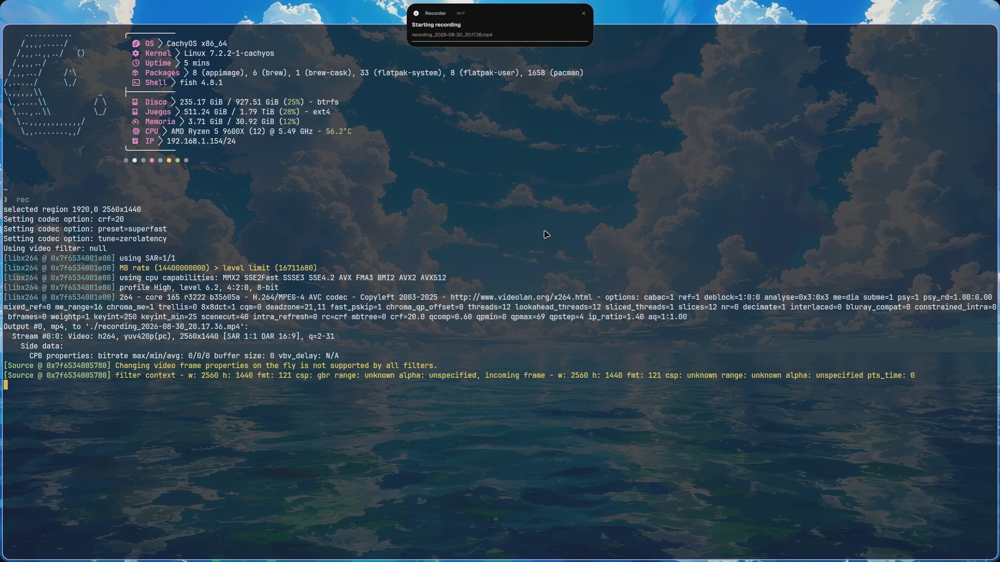

# 🌌 blak0p's Dotfiles Ecosystem

<p align="center">
  
</p>

<p align="center">
  <a href="https://hyprland.org"></a>
  <a href="https://fishshell.com"></a>
  <a href="https://neovim.io"></a>
  <a href="https://quickshell.outfoxxed.me"></a>
  <a href="https://archlinux.org"></a>
</p>

<p align="center">
  A clean, modular, and high-performance developer desktop ecosystem built on <b>Hyprland</b>, <b>Quickshell</b>, <b>Fish</b>, and <b>Neovim</b>.
</p>

---

## 🎬 Visual Showcase

> [!TIP]
> Place your preview videos or animated GIFs inside `assets/demo.mp4` or `assets/demo.gif` to embed them directly.



| Desktop & Dynamic Island | Fish & Modern CLI Stack | Neovim IDE |
| :---: | :---: | :---: |
|  |  |  |
| *Quickshell bar, Dynamic Island & Tiling* | *Kitty, Starship, Atuin & Carapace* | *LazyVim, Snacks Term & Floating UI* |

---

## 🏗️ Architecture & Organization

This repository is designed following a **modular multi-repo umbrella architecture**. Each domain is completely decoupled and wired into this umbrella as an independent Git submodule.

```
dotfiles/ (Umbrella Repository)
├── dotfiles-hyprland/   ──> Hyprland WM, Quickshell UI Stack, GTK Themes, Keybinds
├── dotfiles-shell/      ──> Fish Shell, Starship Prompt, Atuin History, Carapace, Kitty
├── dotfiles-editors/    ──> Neovim (LazyVim, Snacks, Oil, Blink, LSPs)
├── bootstrap-deps.sh    ──> Multi-distro package installer (Arch, Fedora, Debian)
├── bootstrap-host.sh    ──> Full automated machine provisioning
├── deploy-host.sh       ──> Idempotent symlink deployment to ~/.config/
└── install.sh           ──> Unified interactive and flag-based installer
```

---

## 📦 Sub-Repositories Overview

### 1. [`dotfiles-hyprland`](https://github.com/blak0p/dotfiles-hyprland)
* **Window Manager**: Hyprland with custom Minflair-inspired overshot bezier animations and crisp window borders.
* **Desktop Shell**: Quickshell (`ii` panel family) featuring a Dynamic Island, unified Control Center, App Launcher (`Super + Space`), Workspace Overview (`Super + Tab`), and notification center.
* **Dual-Monitor Workspace Sync**: Custom `ws_both(i)` implementation syncing both monitors simultaneously.
* **Built-in Power Utilities**:
  * Region Snipping (`Ctrl + Win + S` / `Super + Shift + S`) with automatic saving to `~/Pictures/Screenshots/` and clipboard sync.
  * Real-time OCR character extraction via Tesseract (`Super + Shift + X`).
  * Visual search via Google Lens integration (`Super + Shift + A`).
  * Real-time screen translation (`Super + Shift + T`).
  * VM Isolation Submap (`Super + Alt + F1`) preventing keybind interception inside virtual machines.
  * Native screen recording with audio via `wf-recorder` (`Ctrl + Alt + R` / `Super + Shift + R`).
* **Jarvis — AI Voice Assistant** (`Win + Shift + Space`): Hands-free voice interaction embedded in the Dynamic Island.
  * Natural conversational responses — no markdown lists or headers, just plain speech.
  * Voice Activity Detection follow-up — after a spoken question, Jarvis automatically listens for your reply without any extra hotkey.
  * Click-to-toggle — tap the Dynamic Island pill or container to start/stop voice interaction.
  * AI quota awareness — ask Jarvis about remaining credits for any provider (Gemini, OpenAI, Anthropic…).
  * Desktop app launcher integration — launch apps by name or ask Jarvis to find ambiguous matches.

### 2. [`dotfiles-shell`](https://github.com/blak0p/dotfiles-shell)
* **Terminal Emulator**: Kitty with custom theme, ligature fonts, and smooth cursor trail.
* **Shell**: Fish shell optimized for instant startup.
* **Prompt**: Starship with custom palette and git status integration.
* **Shell History**: Atuin SQLite-backed interactive history search (`Ctrl + R`).
* **Completions**: Carapace multi-shell completion engine with rich argument descriptions.
* **System Fetch**: Fastfetch configured with custom logos and hardware diagnostics.

### 3. [`dotfiles-editors`](https://github.com/blak0p/dotfiles-editors)
* **Core**: Neovim on top of [LazyVim](https://www.lazyvim.org/).
* **Floating Terminal**: Integrated Snacks popup terminal (`<leader>ft` / `Space + f + t`).
* **File Management**: Oil.nvim buffer-based file editor (`-`).
* **Multi-Language LSP**: Mason-managed Language Servers, Linters, and Formatters (TypeScript, Go, Rust, Python, Nix).
* **Remote Clipboard**: OSC52 support over SSH and container environments.

---

## ⚡ Installation & Quick Start

### 1. Clone with Submodules
```bash
git clone --recurse-submodules https://github.com/blak0p/dotfiles.git ~/dotfiles
cd ~/dotfiles
```

### 2. Install System Dependencies (Multi-Distro)
```bash
./bootstrap-deps.sh
```
*Auto-detects `pacman` (Arch), `dnf` (Fedora), or `apt` (Debian/Ubuntu).*

### 3. Deploy Configurations
```bash
# Deploy the complete stack (Hyprland + Shell + Neovim)
./install.sh --all
```

### Modular Flags

You can install only specific components without affecting the rest of your system:

| Flag | Target Domain | Symlinks Created |
| :--- | :--- | :--- |
| `./install.sh --all` | Full Ecosystem | All sub-repos |
| `./install.sh --hyprland` | Desktop Stack | `hypr/`, `waybar/`, `quickshell/`, `fuzzel/`, `gtk-3.0/`, `gtk-4.0/`, `btop/`, `cava/` |
| `./install.sh --fish` | Shell & Terminal | `fish/`, `starship.toml`, `atuin/`, `carapace/`, `fastfetch/`, `kitty/` |
| `./install.sh --nvim` | Editor | `nvim/` |
| `./install.sh --help` | Help Menu | Show CLI usage & available options |

---

## ⌨️ Essential Keybindings Cheat Sheet

### 🖥️ Window Management & Navigation
| Shortcut | Action |
| :--- | :--- |
| `Super + Return` | Open Kitty terminal |
| `Super + C` | Close active window |
| `Super + F` | Toggle fullscreen |
| `Super + J` | Cycle window focus (same monitor) |
| `Super + H` | Cycle / rotate monitor focus |
| `Super + Left` / `Super + Right` | Move active window to other monitor |
| `Super + 1..9` | Sync workspaces across both monitors simultaneously |
| `Super + Alt + 1..9` | Send active window to workspace `1..9` |

### 🎛️ Quickshell Desktop UI
| Shortcut | Action |
| :--- | :--- |
| `Super + Space` | Open Application Launcher (Fuzzel / Quickshell) |
| `Super + Tab` | Toggle Workspace Overview |
| `Super + N` | Open Right Sidebar / Control Center & Notifications |
| `Super + V` | Open Clipboard History Manager |
| `Super + Period` | Open Emoji Picker |
| `Ctrl + Super + R` | Reload Quickshell UI stack |

### 🛠️ Utilities & Screen Tools
| Shortcut | Action | Destination |
| :--- | :--- | :--- |
| `Ctrl + Win + S` | **Region Screen Snip** | Saves to `~/Pictures/Screenshots/` + Clipboard |
| `Super + Shift + S` | **Region Screen Snip (Alternative)** | Saves to `~/Pictures/Screenshots/` + Clipboard |
| `Print` | **Full Screen Screenshot** | Copies to Clipboard |
| `Ctrl + Print` | **Full Screen Screenshot** | Saves to `~/Pictures/Screenshots/` + Clipboard |
| `Super + Shift + X` | **OCR Text Recognition** | Copies recognized text to Clipboard |
| `Super + Shift + A` | **Google Lens Image Search** | Opens default browser with search |
| `Super + Shift + T` | **Screen Translation** | In-place on-screen translator |
| `Super + Shift + C` | **Color Picker** | Copies Hex `#RRGGBB` to Clipboard |
| `Ctrl + Alt + R` | **Toggle Fullscreen Recording** | Saves `.mp4` to `~/Videos/` |
| `Super + Shift + R` | **Toggle Region Recording** | Saves `.mp4` to `~/Videos/` |
| `Super + Alt + F1` | **Virtual Machine Submap** | Temporarily isolates keybinds for VM guest |

### 📝 Neovim Keymaps
| Shortcut | Action |
| :--- | :--- |
| `<leader>ft` (`Space + f + t`) | Toggle Rounded Floating Terminal |
| `<Ctrl + />` | Toggle Terminal |
| `<leader>ff` (`Space + f + f`) | Find Files (Snacks Picker) |
| `<leader>sg` (`Space + s + g`) | Live Grep in project |
| `-` | Open Oil.nvim parent directory browser |
| `<Ctrl + h/j/k/l>` | Seamless Neovim / Tmux window navigation |

---

## 🔄 Updating & Submodule Maintenance

### Update Everything
```bash
git pull
git submodule update --remote --merge
```

### Developing on a Submodule
```bash
cd dotfiles-shell
git checkout main
# Make edits, commit and push to submodule origin:
git add .
git commit -m "feat(fish): add custom alias"
git push

# Bump the reference in the umbrella repo:
cd ..
git add dotfiles-shell
git commit -m "chore(submodules): bump dotfiles-shell to latest commit"
git push
```

---

## 🛡️ Idempotent Deploy & Rollback

Every deployment automatically creates a timestamped backup before touching existing configuration files:
```
~/.dotfiles-backup-YYYYMMDD-HHMMSS/
```

To rollback or restore:
```bash
BACKUP=$(ls -td ~/.dotfiles-backup-* | head -1)
cp -a "$BACKUP"/.config/. ~/.config/
```

---

## 📄 License

This repository is licensed under the [MIT License](LICENSE). Individual submodules maintain their respective open-source licenses.
