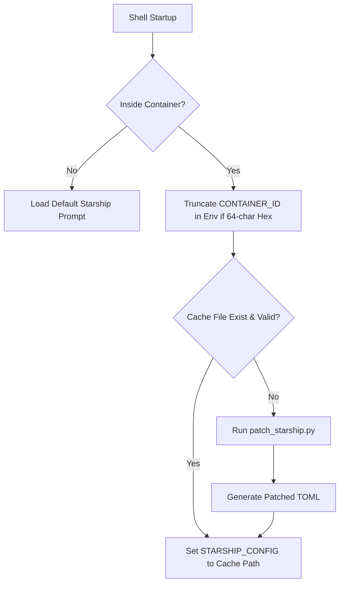

# <Design: Patch Starship Container ID>

## Technical Approach

Inside container environments (where `CONTAINER_ID` is set), the Fish shell hook `patch_starship.fish` dynamically patches the Starship prompt to include a truncated container ID (12-char hex or full name if non-hex) right after the directory. On the host, the default layout is preserved to avoid shell startup overhead.



### Hook Logic (`patch_starship.fish`):
1. Runs only if `CONTAINER_ID` environment variable is set.
2. Truncates `CONTAINER_ID` to 12 characters if it matches a 64-character hexadecimal pattern using fast Fish built-ins.
3. Checks if the cached configuration file exists at `~/.cache/starship/starship_custom.toml`. If the directory or file is not writable, it falls back to `/tmp/starship_custom.toml`.
4. Compares modification dates between the base configuration (`~/.config/starship.toml`) and the cached config file. If the cache is stale or missing, calls `patch_starship.py` to regenerate it.
5. Exports `STARSHIP_CONFIG` pointing to the cached file.

### Python Patcher (`patch_starship.py`):
1. Accepts three arguments: base config path, cached target path, and container ID.
2. Reads the base `starship.toml`.
3. Replaces `$directory` with `$directory$env_var.CONTAINER_ID` in the `format` string.
4. Appends a custom `[env_var.CONTAINER_ID]` TOML configuration block styled to match the prompt palette.
5. Writes the patched configuration to the cache file.

---

## Architecture Decisions

| Option | Tradeoff | Decision |
| :--- | :--- | :--- |
| **Truncation Location** | Truncating in Python runs Python on every shell startup. Truncating in Fish runs instantly with zero external command overhead. | Truncate `CONTAINER_ID` in `patch_starship.fish` shell startup. |
| **Cache Sharing** | Hardcoding the container ID in TOML cache creates conflicts when running multiple containers concurrently. Using `env_var` keeps the TOML generic and reusable. | Reference the dynamic environment variable `$env_var.CONTAINER_ID` in the cached TOML rather than hardcoding. |

---

## Data Flow

    [~/.config/starship.toml] (Base) ──(if stale)──> [patch_starship.py] ──(writes)──> [~/.cache/starship/starship_custom.toml] (Cache)
                                                                                            │
    [$CONTAINER_ID] (Env) ──────────(truncated)─────> [Fish Startup] ────────(exports)──────> [STARSHIP_CONFIG] ──> [Starship Prompt]

---

## File Changes

| File | Action | Description |
|------|--------|-------------|
| `modules/prompt/config/patch_starship.fish` | Create | Fish startup hook that handles caching comparison, fallback, and exports `STARSHIP_CONFIG`. |
| `modules/prompt/config/patch_starship.py` | Create | Python utility to inject container ID prompt blocks and formats into the Starship configuration. |
| `modules/prompt/config/d.fish` | Create | Fish function shortcut `d` to enter distrobox `dev` container directly inside the `~/dev/` directory. |
| `modules/prompt/install.sh` | Modify | Replaces obsolete `starship.tom` and `starship.tomls` links with symlinks for the new Fish hook, Python script, and shortcut `d.fish`. |
| `doctor.sh` | Modify | Removes the health check for legacy `starship.tom` symlink to prevent false-negative warnings. |
| `home/.config/fish/` | Delete | Cleans up legacy Fish configurations to avoid unmanaged shell dotfiles in the Git repository. |
| `home/.config/starship.toml` | Delete | Removes duplicate base config file from `home/` to enforce use of `config/starship.toml`. |
| `home/.config/nvim/` | Delete | Removes legacy Neovim configurations from git to delegate to dedicated external managers. |
| `home/.config/zellij/` | Delete | Cleans up unmanaged Zellij layout files to keep dotfiles repo clean. |
| `modules/prompt/config/starship.tom` | Delete | Removes typo config file. |
| `modules/prompt/config/starship.tomls` | Delete | Removes duplicate/typo config file. |

---

## Interfaces / Contracts

### Fish Hook Template (`patch_starship.fish`)
```fish
if set -q CONTAINER_ID
    # Truncate hex ID to 12 chars if it is 64-char hexadecimal
    if string match -r '^[0-9a-fA-F]{64}$' "$CONTAINER_ID" >/dev/null
        set -gx CONTAINER_ID (string sub -l 12 "$CONTAINER_ID")
    end

    set -l base_config "$HOME/.config/starship.toml"
    set -l cache_dir "$HOME/.cache/starship"
    set -l cache_file "$cache_dir/starship_custom.toml"

    if not test -d "$cache_dir"
        mkdir -p "$cache_dir" 2>/dev/null
    end

    if not test -w "$cache_dir"; or not test -w "$cache_file" -a -f "$cache_file"
        if not test -w "$cache_dir"
            set cache_file "/tmp/starship_custom.toml"
        end
    end

    if not test -f "$cache_file"; or test "$base_config" -nt "$cache_file"
        python3 "$HOME/.config/fish/patch_starship.py" "$base_config" "$cache_file" "$CONTAINER_ID"
    end

    if test -f "$cache_file"
        set -gx STARSHIP_CONFIG "$cache_file"
    end
end
```

### Python Patcher Template (`patch_starship.py`)
```python
import sys
import re

def main():
    base_path = sys.argv[1]
    cache_path = sys.argv[2]
    container_id = sys.argv[3]

    with open(base_path, 'r', encoding='utf-8') as f:
        content = f.read()

    # Inject CONTAINER_ID env_var right after directory segment in format
    patched_content = content.replace('$directory', '$directory$env_var.CONTAINER_ID')

    # Append the env_var block
    custom_block = (
        "\n[env_var.CONTAINER_ID]\n"
        "variable = \"CONTAINER_ID\"\n"
        "style = \"bg:color_teal fg:color_fg0\"\n"
        "format = \" [($value)]($style)\"\n"
    )
    patched_content += custom_block

    with open(cache_path, 'w', encoding='utf-8') as f:
        f.write(patched_content)

if __name__ == '__main__':
    main()
```

### Distrobox Shortcut Function (`d.fish`)
```fish
function d; distrobox enter dev --workdir ~/dev $argv; end
```

---

## Testing Strategy

| Layer | What to Test | Approach |
|-------|-------------|----------|
| Unit | Python patcher formatting | Verify Python helper parses `starship.toml` and inserts the `env_var` block and format reference correctly. |
| Integration | Fish caching logic | Verify cache is generated only when missing or when `starship.toml` is newer. Test fallback to `/tmp` on read-only system. |
| E2E | Prompt presentation | Start a container shell and verify the prompt includes `(dev-env)` or truncated `(a1b2c3d4e5f6)` after directory. |

---

## Migration / Rollout

No migration required. Applying the prompt module using `./install.sh` will clean up legacy configurations and link the new patch scripts.
